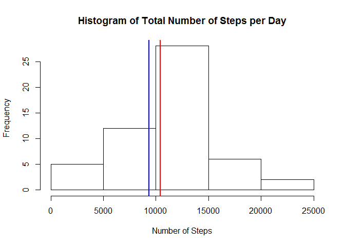
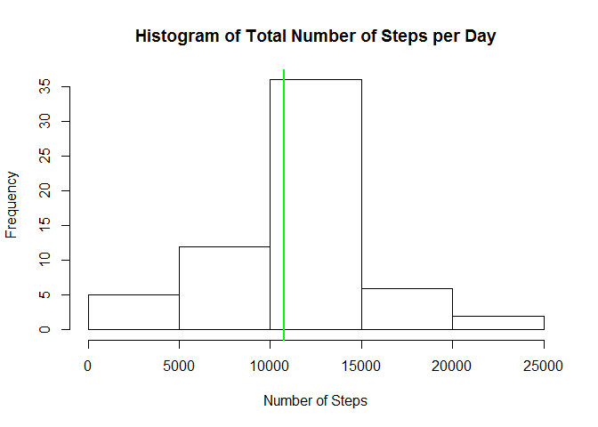
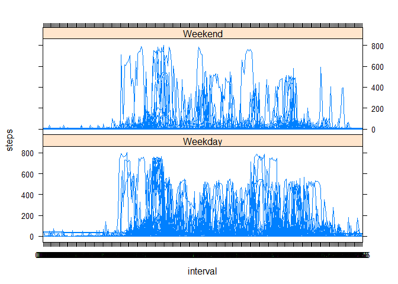

Reproducible research - Project 1
========================================================

### Loading and preprocessing the data

```r
activity <- read.csv("activity.csv")
```

### What is the average total number of steps taken per day?
Transform date.

```r
activity$date <- as.Date(activity$date, format="%Y-%m-%d")
```

```
## Warning in strptime(x, format, tz = "GMT"): unable to identify current timezone 'R':
## please set environment variable 'TZ'
```

```
## Warning in strptime(x, format, tz = "GMT"): unknown timezone 'localtime'
```

Calculate mean. Here we calculate the mean and median first so that they can easily be added to the histogram.

```r
mean1 <- mean(tapply(activity$steps, activity$date, sum, na.rm=T))
mean1
```

```
## [1] 9354.23
```

Calculate median.

```r
median1 <- median(tapply(activity$steps, activity$date, sum, na.rm=T))
median1
```

```
## [1] 10395
```

Create histogram.

```r
hist(tapply(activity$steps, activity$date, sum), main="Histogram of Total Number of Steps per Day", xlab="Number of Steps")
abline(v=mean1, col = "blue", lwd = 2)
abline(v=median1, col = "red", lwd = 2)
```

 
The mean is shown in blue and the median is shown in red.

### What is the average daily activity pattern?
Convert interval to time with 4 digits.

```r
activity$interval <- formatC(activity$interval, width = 4, flag = 0)
activity$interval <- as.factor(activity$interval)
```

Plot number of steps per 5-minute interval.

```r
plot(tapply(activity$steps, activity$interval, mean, na.rm=T), type="l", axes=F, main="Average Number of Steps per Time of Day",
     xlab="Time of Day (in 5-minute intervals)", ylab="Average Number of Steps")
labels <- c("00:00", "01:00", "02:00", "03:00", "04:00", "05:00", "06:00", "07:00", "08:00", "09:00", "10:00", "11:00", "12:00", 
            "13:00", "14:00", "15:00", "16:00", "17:00", "18:00", "19:00", "20:00", "21:00", "22:00", "23:00", "24:00")
axis(side=1, at = seq(from=0, to=288, by=12), las = 3, labels=labels)
axis(side=2, at = c(50, 100, 150, 200), las = 1)
box()
```

 

Which interval has the highest average number of steps?

```r
which.max(tapply(activity$steps, activity$interval, mean, na.rm=T))
```

```
## 0835 
##  104
```
The interval with the highest average number of steps is 0835, i.e. 8.35am.

### Imputing missing values
Calculate how many rows with NAs.

```r
nrow(activity) - nrow(na.omit(activity))
```

```
## [1] 2304
```
There are 2304 observations with missing values.

Now create a new data frame which includes imputed values for NAs. The method we choose is to use the mean of each 5-minute interval.

```r
activity2 <- activity
activity2$steps[is.na(activity2$steps)] <- tapply(activity2$steps, activity2$interval, mean, na.rm=T)
nrow(activity2) - nrow(na.omit(activity2))
```

```
## [1] 0
```
There are no longer any NAs.

Calculate mean (of revised data frame).

```r
mean2 <- mean(tapply(activity2$steps, activity2$date, sum))
mean2
```

```
## [1] 10766.19
```

Calculate median (of revised data frame).

```r
median2 <- median(tapply(activity2$steps, activity2$date, sum))
median2
```

```
## [1] 10766.19
```
The mean and median (which now have the same value and are shown in green below) have both increased as a result of imputing the missing values.

Create histogram (of revised data frame).

```r
hist(tapply(activity2$steps, activity2$date, sum), main="Histogram of Total Number of Steps per Day", xlab="Number of Steps")
abline(v=mean2, col = "green", lwd = 2)
```

 

### Are there differences in activity patterns between weekdays and weekends?
Split into weekday/weekend.

```r
activity2$dayofweek <- factor(format(activity2$date, "%a"))
levels(activity2$dayofweek) <- c("Weekday", "Weekday", "Weekend", "Weekend", "Weekday", "Weekday", "Weekday")
```

Plot average number of steps for weekday/weekend.

```r
require(lattice)
```

```
## Loading required package: lattice
```

```r
xyplot(steps ~ interval | dayofweek, data = activity2, type="l", layout= c(1, 2))
```

 
