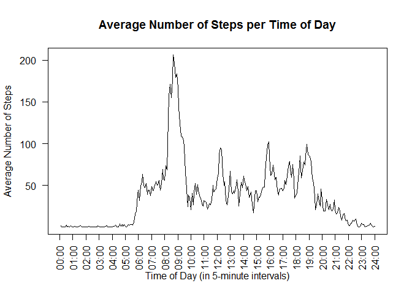

# Reproducible Research: Peer Assessment 1


## Loading and preprocessing the data


```r
library(dplyr)
```

```
## Warning: package 'dplyr' was built under R version 3.2.1
```

```
## 
## Attaching package: 'dplyr'
## 
## The following objects are masked from 'package:stats':
## 
##     filter, lag
## 
## The following objects are masked from 'package:base':
## 
##     intersect, setdiff, setequal, union
```

```r
zipFile <- "activity.zip"
activityDataWithNA <- tbl_dt(read.csv(unzip(zipFile), colClasses=c("integer", "Date", "integer")))
```

```
## Loading required namespace: data.table
```

```
## Warning in strptime(xx, f <- "%Y-%m-%d", tz = "GMT"): unable to identify current timezone 'R':
## please set environment variable 'TZ'
```

```
## Warning in strptime(xx, f <- "%Y-%m-%d", tz = "GMT"): unknown timezone
## 'localtime'
```

```r
print(activityDataWithNA)
```

```
## Source: local data table [17,568 x 3]
## 
##    steps       date interval
## 1     NA 2012-10-01        0
## 2     NA 2012-10-01        5
## 3     NA 2012-10-01       10
## 4     NA 2012-10-01       15
## 5     NA 2012-10-01       20
## 6     NA 2012-10-01       25
## 7     NA 2012-10-01       30
## 8     NA 2012-10-01       35
## 9     NA 2012-10-01       40
## 10    NA 2012-10-01       45
## ..   ...        ...      ...
```

## What is mean total number of steps taken per day?

```r
activityData <- na.omit(activityDataWithNA)
totalSteps <- sum(activityData$steps)
print(totalSteps)
```

```
## [1] 570608
```

```r
hist(activityData$steps)
```

 

```r
meanMedianFunc <- function(x) {
  data.frame(mean = round(mean(x, na.rm = TRUE)),
    median = round(median(x, na.rm = TRUE)))
}
meanMedian <-meanMedianFunc(activityDataWithNA$steps)
print(meanMedian)
```

```
##   mean median
## 1   37      0
```
## What is the average daily activity pattern?

```r
plotWithMaxByInterval <- function(activityData) {
  byInterval <- activityData %>% group_by(interval) %>% summarize(steps=sum(steps))
  plot(byInterval, type="l")
  maxSteps <- max(byInterval$steps)
  maxInterval <- byInterval %>% filter(steps == maxSteps)
  maxInterval <- maxInterval$interval[1]
  points(x=maxInterval, y=maxSteps, col = "magenta", lwd = 6)
  abline(v=maxInterval, col = "magenta", lwd = 3)
  print(data.frame(maxInterval=maxInterval, maxSteps=maxSteps))
}
plotWithMaxByInterval(activityData)
```

 

```
##   maxInterval maxSteps
## 1         835    10927
```
## Imputing missing values

```r
totalNAcount <- sum(is.na(activityDataWithNA))
print(totalNAcount)
```

```
## [1] 2304
```

```r
meanByInterval <- activityData %>% group_by(interval) %>% summarize(mean=round(mean(steps)))
activityFilled <- left_join(activityDataWithNA, meanByInterval) %>%
                  mutate(steps = ifelse(is.na(steps), mean, steps)) %>% select(-mean)
```

```
## Joining by: "interval"
```

```r
print(table(is.na(activityFilled)))
```

```
## 
## FALSE 
## 52704
```

```r
meanMedian2 <- meanMedianFunc(activityFilled$steps)
plotWithMaxByInterval(activityFilled)
```

 

```
##   maxInterval maxSteps
## 1         835    12575
```
Do mean and median values differ from the estimates from the first part of the research?

```r
print(data.frame(
  difMeanAfterFilling=meanMedian, 
  difMedianAfterFilling=meanMedian2))
```

```
##   difMeanAfterFilling.mean difMeanAfterFilling.median
## 1                       37                          0
##   difMedianAfterFilling.mean difMedianAfterFilling.median
## 1                         37                            0
```
What is the impact of imputing missing data on the estimates of the total daily number of steps?

```r
totalStepsAdded <- sum(activityFilled$steps) - totalSteps
impactRatio <- round(totalStepsAdded/totalSteps, 2)
print(data.frame(totalStepsAdded=totalStepsAdded, impactRatio=impactRatio))
```

```
##   totalStepsAdded impactRatio
## 1           86096        0.15
```
## Are there differences in activity patterns between weekdays and weekends?

```r
Sys.setlocale("LC_TIME", "English")
```

```
## [1] "English_United States.1252"
```

```r
activityFilled <- activityFilled %>% mutate(dayweek = factor(ifelse(
                                            weekdays(date) %in% c("Saturday", "Sunday"), 
                                            "weekend", "weekday")))
activityWeekday <- activityFilled %>% filter(dayweek == "weekday") %>%
                   group_by(interval) %>% summarise(steps=sum(steps))
activityWeekend <- activityFilled %>% filter(dayweek == "weekend") %>%
                   group_by(interval) %>% summarise(steps=sum(steps))
par(mfrow = c(2, 1), mar = c(4, 4, 2, 1))
plot(activityWeekday, type="l", main = "Weekday")
plot(activityWeekend, type="l", main = "Weekend")
```

 
